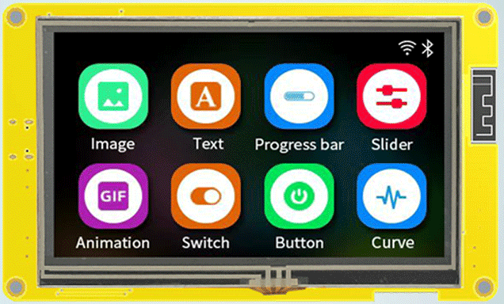

# SquareLaineStrudio-for-4inch_Esp32_4827S043_v1.0

Board definition for HMI 4"LCD Esp32-4827S043

Aliexpress : https://pl.aliexpress.com/item/1005004788147691.html

Generated files for VS Code + PlatformIO

Board definiton for 7" LCD version : https://github.com/dkm1978/SquareLineStudio-for-7inch_Esp32_8048S070C_v1.0
Board definiton for Simple GUI tester : https://github.com/dkm1978/SquareLineStudio-for-7inch_Esp32_8048S070C_v1.0

Have FUN xD
